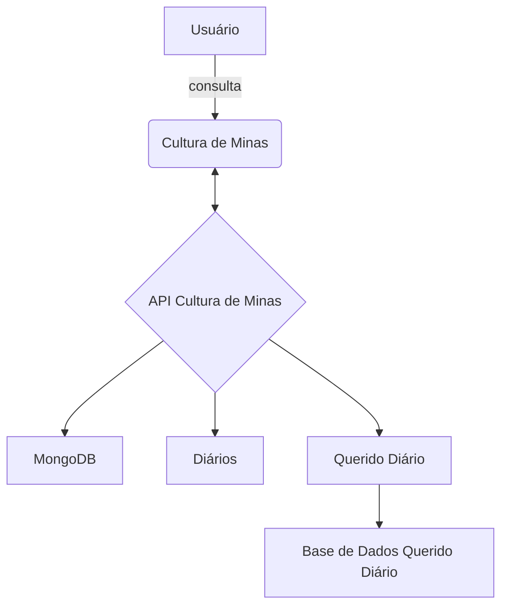

# Arquitetura

Apresentamos a versão inicial da nossa arquitetura, combinando tecnologias chave com as funcionalidades essenciais do nosso serviço. Com um design intuitivo e baseado na própria arquitetura do Querido Diário.

<iframe width="768" height="432" src="https://miro.com/app/live-embed/uXjVKVdk0Cw=/?moveToViewport=-1282,-998,3354,1540&embedId=3332397580" frameborder="0" scrolling="no" allow="fullscreen; clipboard-read; clipboard-write" allowfullscreen></iframe>

## Tecnologias

Dado o objetivo principal do projeto, criar uma plataforma online de análise e armazenamento de dados de licitações relacionadas aos gastos culturais apoiados pelo Governo Federal no estado de Minas Gerais, é indispensável a seleção apropriada das tecnologias para o projeto. As tecnologias abaixo foram estudas para cada caso de uso, desde uso geral até usos específicos.

## Funcionalidades Previstas

Analisando os requisitos do projeto podemos identificar algumas funcionalidades, e com base nelas buscamos as tecnologias mais apropriada para cada situação.

## 📁 Coleta de Dados

A parte da coleta de dados é uma das mais importantes do projeto, e baseado na API do querido diário, encontramos algumas tecnologias que podem nos ajudar durante o processo de desenvolvimento e de produção, sendo elas:

- _[Python](https://www.python.org/)_: Linguagem de programação para fazer os limpadores de dados na Web
- Framework _[Scrapy](https://scrapy.org/)_: Framework Python para trabalhar com spiders(limpadores da Web). Através das spiders podemos fazer raspagem de dados na web
- _[Beautiful Soup](https://beautiful-soup-4.readthedocs.io/en/latest/)_: Biblioteca Python que permite fazer a conversão de elementos HTML em strings. E não apenas isso, mas também nós permite buscar por classes, id's e tipo de dados dentro do documento HTML.
- _[Selenium](https://www.selenium.dev/)_: Biblioteca Python para interagir com o browser. Permite fazer buscas que necessitam de interação com a interface.
- _[FastAPI](https://fastapi.tiangolo.com/)_: Biblioteca Python para criar servidor e receber requisições HTTP para enviar os dados dos escavadores.

## 📊 Análise e Armazenamento

A análise dos dados podem ser feitas tanto de forma iterativas, na interface web, quanto do lado do servidor, e para isso temos duas abordagens diferentes:

### Análise

Para a análise do lado do **servidor**, podemos utilizar tanto o a API em _[Python](https://www.python.org/)_ quanto uma API em _[Node.js](https://nodejs.org/en)_.

Para análise dos dados do lado do **cliente**, há diversas bibliotecas para o _[React](https://react.dev/)_, que permite o desenvolvimento de gráficos e renderização dos dados de forma dinâmica.

### Armazenamento

No armazenamento temos duas opções muito atrativas, o _[MongoDB](https://www.mongodb.com/pt-br)_ e o _[Postgres](https://www.postgresql.org/)_. Ambos são ótimos para armazenar os dados, mas para cada parte da aplicação precisamos decidir se um modelo relacional, otimizado para buscas complexas e inserção é melhor que um modelo não-relacional, com liberdade de estrutura e organização por documentos.

## 🗃 Visualização de Dados

Quando se trata de visualização, estamos tratando da nossa interface Web, que sem dúvidas um ótimo framework para resolver este problema é o _[Next.js](https://nextjs.org/)_. Ele permite fazer renderização do lado do servidor, trabalhar com rotas de uma forma descomplicada, estrutura de pastas dinâmicas e diversas outras features.
Como o _[Next.js](https://nextjs.org/)_ é um framework construído por cima do _[React](https://react.dev/)_, podemos utilizar muitas bibliotecas para plotagem dos dados, dentre elas se destacam: _[React-Charts](https://react-charts.tanstack.com/)_ e a _[Apexcharts](https://react-charts.tanstack.com/)_. Fica a critério do time em tempo de desenvolvimento decidir quais são as mais adequadas para cada situação.

## 🖥 API Intermediária

Uma das idéias é fazer um sistema de notificação para avisar aos inscritos da plataforma sobre novas licitações com gastos culturais do estado de Minas Gerais, também queremos salvas algumas licitações no nosso banco de dados, e para fazer todo esse trabalho uma ótima ferramenta é o _[Node.js](https://nodejs.org/en)_, dado que nós estaremos trabalhando com _[Next.js](https://nextjs.org/)_, trabalhar com a mesma linguagem tanto do lado do servidor quanto do lado do cliente otimiza os estudos e o tempo de desenvolvimento do time. Para fazer essa API, podemos utilizar algumas bibliotecas, sendo elas:

- _[Express](https://expressjs.com/)_: Criação de servidor para receber requisições HTTP e processar os dados.
- _[Nodemailer](https://www.nodemailer.com/)_: Enviar emails de dentro da nossa aplicação para os inscritos da plataforma.
- _[Prisma](https://www.prisma.io/)_: ORM para manipulação dos bancos de dados.

Vale resaltar que ambos, Node.js e o React.js podem ser escritos por cima das linguagens _[Javascript](https://www.javascript.com/)_ e _[Typescript](https://www.typescriptlang.org/)_. Portanto vai depender da escolha do time em tempo de desenvolvimento qual será a mais aquada para cada serviço.

## 🛠 Infraestrutura

Uma parte importante da nossa aplicação é aonde vamos publicar. Como não temos uma plataforma definitiva, é crucial desenvolver todo o ecossistema em microsserviços. Com o _[Docker](https://www.docker.com/)_ podemos desenvolver a aplicação em um ambiente controlado, onde determinamos de ponta a ponta os recursos que vão ser utilizados, bibliotecas que vão ser instaladas e configuração de rede para a comunicação dos microsserviços.

# Conclusão das Tecnologias Escolhidas

- **Linguagem de Programação:** [Python](https://docs.python.org/3/), [Javascript](https://www.javascript.com/) e [Typescript.](https://www.typescriptlang.org/)
- **Framework Web:** [Next.js](https://nextjs.org/).
- **Banco de Dados:** [Postgres](https://www.postgresql.org/) ou [MongoDB](https://www.mongodb.com/pt-br) (a depende do caso de uso).
- **Ferramenta de Coleta de Dados:** Framework [Scrapy](https://scrapy.org/) com auxilio das bibliotecas [Beautiful Soup](https://beautiful-soup-4.readthedocs.io/en/latest/) e [Selenium](https://www.selenium.dev/).
- **Tecnologias Adicionais:** [Docker](https://www.docker.com/), [Express](https://expressjs.com/), [FastAPI](https://fastapi.tiangolo.com/), [Prisma](https://www.prisma.io/), [Nodemailer](https://www.nodemailer.com/), [React](https://react.dev/) e [Tailwind](https://tailwindcss.com/).

## 📁 Histórico de versão

| Versão |    Data    |                                    Descrição                                     |      Autor      |
| :----: | :--------: | :------------------------------------------------------------------------------: | :-------------: |
|  3.0   | 25/04/2024 |                     Reestruturando Documento de Arquitetura                      | Rafael Carvalho |
|  2.2   | 25/04/2024 |                     Adicionando emojis nos tópicos                       | Isaac Batista |
|  2.1   | 17/04/2024 | Exemplificação de uso da API do Querido Diário e Atualização da issue de suporte | Rafael Carvalho |
|  2.0   | 17/04/2024 |                         Crição do esboço de arquitetura                          | Gabriel Scheidt |
|  1.0   | 14/04/2024 |                         Crição do esboço de arquitetura                          | Gabriel Scheidt |
