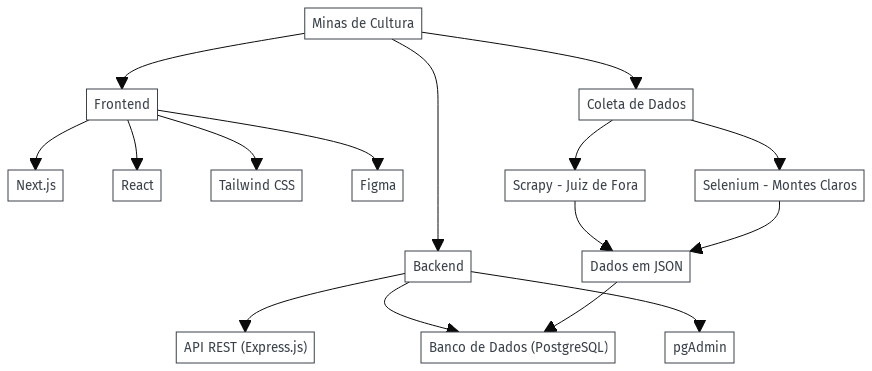

# Arquitetura

### Frontend

O frontend do projeto foi desenvolvido utilizando **Next.js**, um poderoso framework React que facilita a renderização do lado do servidor e a criação de aplicações web altamente performáticas. A interface do usuário foi construída com **React** e estilizada com **Tailwind CSS**, um framework de CSS utilitário que permite criar componentes personalizados e responsivos com facilidade.

O desenvolvimento do frontend seguiu fielmente o protótipo elaborado no **Figma**, garantindo que a experiência do usuário fosse consistente e alinhada com as expectativas de design.

### Backend

O backend do projeto é uma **API REST** desenvolvida com **Express.js**, um framework minimalista para Node.js. Essa API é responsável por gerenciar as requisições e interagir com o banco de dados **PostgreSQL**, onde os dados são armazenados e consultados. Para facilitar a administração e o gerenciamento do banco de dados, utilizamos o **pgAdmin**, uma ferramenta robusta e eficiente para gerenciar bancos de dados PostgreSQL.

### Coleta de Dados

A coleta de dados para o projeto foi realizada utilizando duas abordagens distintas:

- **Scrapy**: Utilizado para coletar dados da cidade de **Juiz de Fora**. O site dessa cidade era bem organizado, e os dados eram disponibilizados em PDFs que seguiam uma lógica de URL consistente, facilitando a raspagem automatizada de informações.

- **Selenium**: Utilizado para coletar dados da cidade de **Montes Claros**. Apesar do site ser estruturado, ele não disponibilizava os dados de forma acessível para raspadores convencionais. Portanto, foi necessário utilizar o **Selenium** junto com um driver de navegador para simular interações humanas e extrair as informações necessárias.

Ambos os raspadores armazenam os dados coletados em arquivos JSON. Esses arquivos são posteriormente consultados pelo backend e os dados são armazenados na API para facilitar o acesso e a apresentação das informações ao usuário final.

# Conclusão das Tecnologias Escolhidas

- **Linguagem de Programação:** [Python](https://docs.python.org/3/), [Javascript](https://www.javascript.com/) e [Typescript.](https://www.typescriptlang.org/)
- **Framework Web:** [Next.js](https://nextjs.org/).
- **Banco de Dados:** [Postgres](https://www.postgresql.org/) 
- **Ferramenta de Coleta de Dados:** Framework [Scrapy](https://scrapy.org/) com auxilio das bibliotecas [Beautiful Soup](https://beautiful-soup-4.readthedocs.io/en/latest/) e [Selenium](https://www.selenium.dev/).
- **Tecnologias Adicionais:** [Docker](https://www.docker.com/), [Express](https://expressjs.com/), [React](https://react.dev/) e [Tailwind](https://tailwindcss.com/).

## 📁 Histórico de versão

| Versão |    Data    |                                    Descrição                                     |      Autor      |
| :----: | :--------: | :------------------------------------------------------------------------------: | :-------------: |
|  4.0   | 16/08/2024 |                     Reestruturação da arquitetura                                | Gabriel Scheidt|
|  3.0   | 25/04/2024 |                     Reestruturando Documento de Arquitetura                      | Rafael Carvalho |
|  2.2   | 25/04/2024 |                     Adicionando emojis nos tópicos                       | Isaac Batista |
|  2.1   | 17/04/2024 | Exemplificação de uso da API do Querido Diário e Atualização da issue de suporte | Rafael Carvalho |
|  2.0   | 17/04/2024 |                         Crição do esboço de arquitetura                          | Gabriel Scheidt |
|  1.0   | 14/04/2024 |                         Crição do esboço de arquitetura                          | Gabriel Scheidt |
