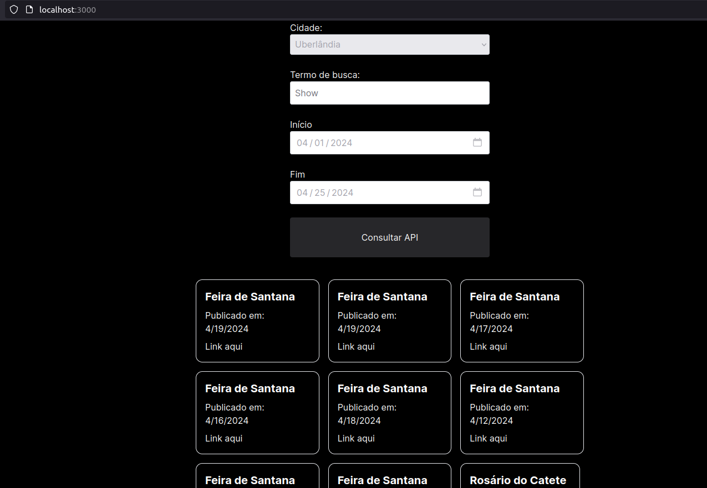

# Protótipo de utilização da API do Querido Diário

Para fins de testes, desenvolvemos um protótipo de utilização da API do Querido Diário. Tínhamos dúvidas sobre como fazer as requisições e receber os dados, então optamos por criar um formulário. Nesse formulário, o usuário pode inserir um município (limitado aos municípios de Minas Gerais), um termo de busca e um intervalo de datas. Em seguida, o sistema realiza uma solicitação à API do Querido Diário com os parâmetros fornecidos.

Os dados retornados pela API são então renderizados na tela, possibilitando ao usuário visualizar todas as respostas obtidas. Essa abordagem nos permite testar a integração com a API e entender como os dados são estruturados, facilitando o desenvolvimento de futuras funcionalidades.



# Como testar o protótipo?

Certifique-se de ter a [versão 20.12 do  Node.js](https://nodejs.org/en) instalado no seu computador.

## 1. Clonar o repositório
Na sua máquina via CLI, copie o comando abaixo e cole no seu terminal.
```bash
git clone https://github.com/unb-mds/2024-1-MinasDeCultura.git
```

## 2. Instalar Dependências
Após clonar o repositório, entre no diretótio `prototipo_form/` e digite o seguinte comando para instalar as dependências do projeto:
```bash
npm install
```

## 3. Iniciar servidor de desenvolvimento
Com as dependências instaladas, basta digitar o comando abaixo para iniciar o servidor de desenvolvimento do Next.js.
```bash
npm run dev
```

Após seguir esses passos, o servidor de desenvolvimento estará em execução e você poderá acessar o protótipo em seu navegador através do endereço fornecido pelo servidor. Certifique-se de testar todas as funcionalidades conforme necessário.
